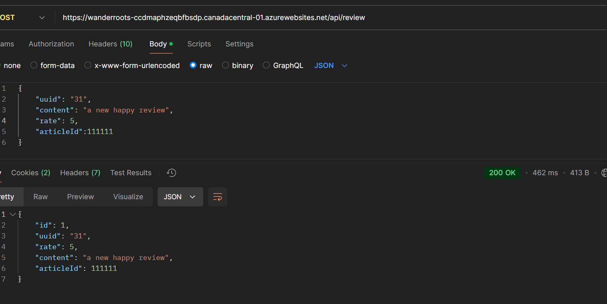

# WanderRoots-Backend

### API documentation

##### Get articles by country

route: article/country/{countryName}
method: GET
returns: list of articles

##### Get all countries

route: article/countries
method: GET
returns: list of countries

##### Get article by id

route: article/detail/{id}
method: GET
returns: article

##### Get reviews by article id

route: review/article/{id}
method: GET
returns: list of reviews

##### review by article id and uuid

route: review/article/{articleId}
method: POST
returns: list of reviews

##### Create review

route: review
method: POST
returns: review

##### Update review

route: review/{id}
method: PUT
returns: review
body: {
    "rate": 5,
    "content": "This is a test review",
    "articleId": 1,
    "uuid": "123e4567-e89b-12d3-a456-426614174000"
}

##### delete review

route: review/{id}
method: DELETE
returns: 204 no content

##### Get article image by id

route: article/{id}/image
method: GET
returns: article image

